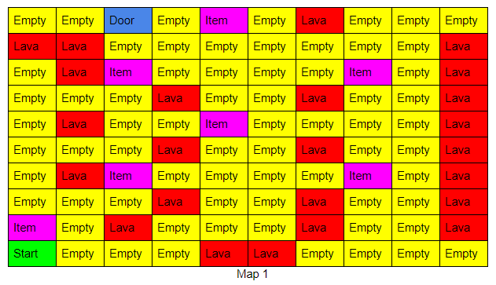
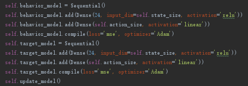
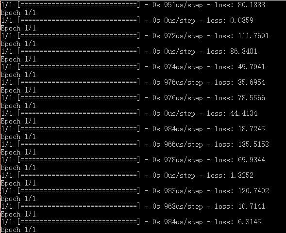
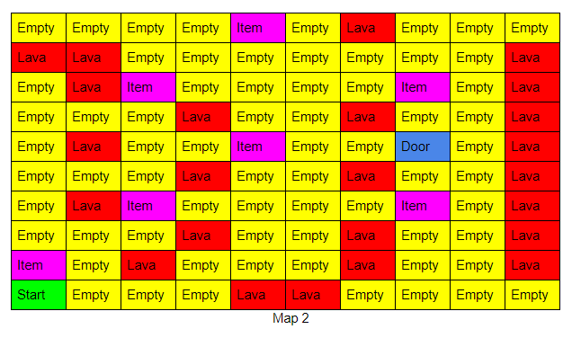
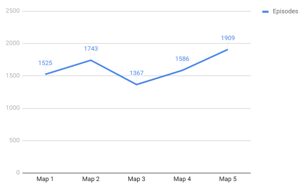

<iframe width="560" height="315" src="https://www.youtube.com/embed/lFxRfJR6B8A" frameborder="0" allow="accelerometer; autoplay; encrypted-media; gyroscope; picture-in-picture" allowfullscreen></iframe>

## Project Summary

The main goal for our project is creating some simple maze and navigate an agent through it. The only information we give to our agent is the states that represent agent position and map blocks. We do not provide any information such like what’s the target, what will happen if the agent falls in the lava, what will happen if the agent picks an item and the results of any actions. We believe this is a challenging problem for AI to learn and perfectly suitable to solve this by Reinforcement Learning. Based on the discussion in the group and the suggestions from our mentor, we decide that we will make our agent solve a 10x10 maze for the final report. To create a more complex problem, we do put some items on the map which will give the agent extra rewards. We expected the agent to pick the item near the final target (door) and give up items that far away from the target. However, different from the previous idea we have, in order to simplify the problem the agent now automatically pick the item when it hits it. A pickup action is no longer required. For the result, we expect after a long time training, the AI agent can find the path that leads to the maximum rewards.

## Approaches

Since our agent has great performance when we doing the baseline problem, we remain most part of our agent code the same. We are still using Deep Q-learning algorithm to train the agent. However, in the status report, many people have commented that using 4000 episodes to train agent solving a 5x5 map is not efficient enough. We do think so! This time, instead of a three-layer neural network we build a two-layer neural network (only one hidden layer) because in most of the time the number of layers will directly affect the learning speed. Since it’s a 10x10 map (map 1) now, the input layer accepts 100 input as features which is our states. The states are just a list of converted map information. For example, for the block 2-3 on the map, the state for it will be (grand, 0). The first element indicates what type the block is, and the second element is a boolean value that indicates that if the agent is standing on that block or not. 

The output layer has 4 outputs and each indicates the expected Q value of that action. And different from using a fixed epsilon number like last time, we make the epsilon keep decreasing from 1 until it equals 0.1. In this way, the agent will take every action randomly in the beginning. So the agent is able to learn more information faster. We are still doing experience replay with memory size 2000 and minimum batch size 35 for good performance. We also involve the Double Q-learning strategy which is using two neural networks to estimate the q value. 

By the above approach, our agent is allowed to learn the shortest path to the door after 1500 episodes. Compare to the baseline agent, our new agent has many advantages. It learns much faster while the map is 4 times bigger, the required learning episodes decrease from 4000 to 1500. It’s also more reliable since it takes less random actin after some training time. However, it also has some disadvantages. First, since we now just have one hidden layer, when the problem gets more complex, it may take more time to learn and the result gets less accurate. Second, the q value will be underestimated which means it may take longer to get the optimal score because of the double neural network.

## Evaluation

Referring to our evaluation plan on the proposal, we need to measure the processing time (episodes, actual time vary by hardware), items collected, and the final score based on our rewards map. The 10x10 map and improved AI we have is referring to the Impressive example of our qualitative evaluation. The agent takes about 1500 episodes to find the path to get out, and after 500 more episodes (2000 in total) it learns to pick two items, we didn’t measure how long it takes it to get the possible maximum score because of time shortage. We also evaluate agent performance through different maps. In all the tests, it can find the path to the door within 500 episodes differences which satisfied our goal well. The average loss is also lower than the previous one. In conclusion, the agent completely reaches our final target. 

## References
- https://machinelearningmastery.com/how-to-define-your-machine-learning-problem/
- https://datascience.stackexchange.com/questions/20535/what-is-experience-replay-and-what-are-its-benefits
- http://web.stanford.edu/class/psych209/Readings/MnihEtAlHassibis15NatureControlDeepRL.pdf
- https://keras.io/models/sequential/#sequential-model-methods
- https://towardsdatascience.com/double-q-learning-the-easy-way-a924c4085ec3
