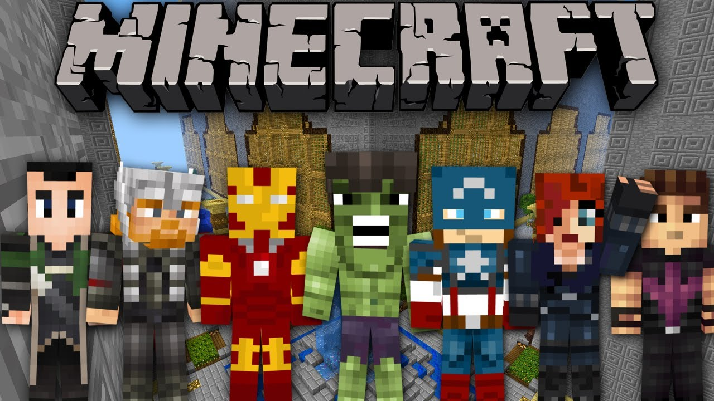
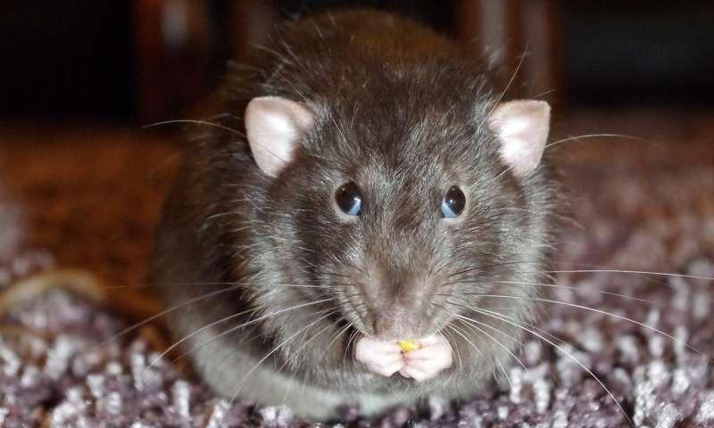
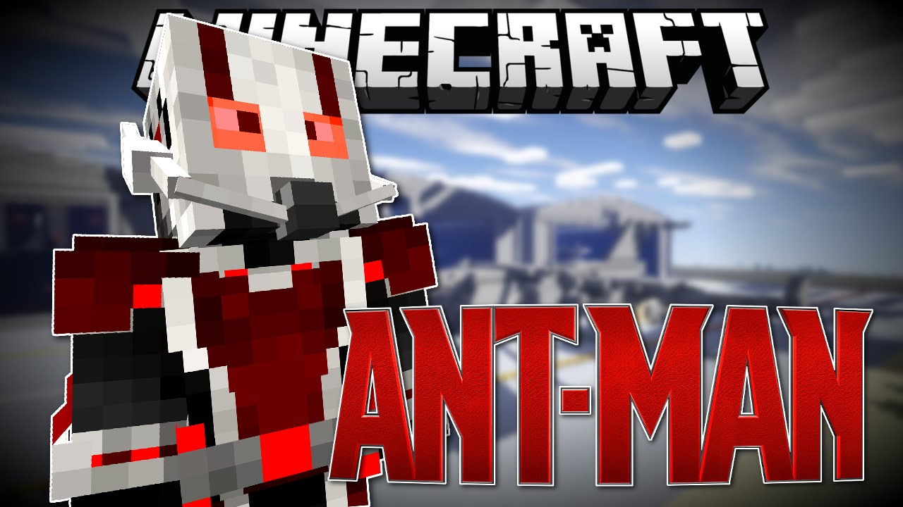

# We are avengers!

In the movie of Avengers: Endgame, Thanos has already been defeated. Earth, no, the whole universe is been saved. However, in another world, the world of Minecraft. Our ture hero

has been caught by a black cat. Ant-man is still stuck in the quantum world, the Minecraft world is now in danger. 

To get everything back on track, we, the team Avengers, decide to train an agent using Deep Q-learning to help ant-man get out the quantum maze.

## Mission accept! Hurry up! 

Wanna help us? Check the following:

- [Proposal](https://github.com/kexuejia911/Avengers/blob/master/docs/proposal.md)
- [Status](https://github.com/kexuejia911/Avengers/blob/master/docs/status.md)
- [Final](https://github.com/kexuejia911/Avengers/blob/master/docs/final.md)

[quickref]: https://stevendesora.wix.com/avengers
