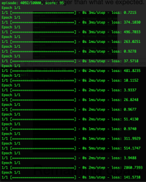

<iframe width="560" height="315" src="https://www.youtube.com/embed/z6rx2-dZaIE" frameborder="0" allow="accelerometer; autoplay; encrypted-media; gyroscope; picture-in-picture" allowfullscreen></iframe>\

## Project Summary

After the discussion with our mentor, we decide to simplify our project to make the AI more testable by having a shorter train time. Our main goal is still creating some simple maze and navigate an agent through it and extra rewards will still be implemented throughout the maze to produce more complex problems and solutions. However, instead of involving both item collection and selection AI, we decide to remove the item selection part to simplify the problem. During the process, the agent will be allowed to get out by just having the key without selecting and using it. Traps are removed, other items are now for higher rewards only. After a long time training, the AI agent should be able to know how to get out the maze, and smartly pick up some reward items for any randomly generated map with the same property.

## Approach

For the status report, we are only making minimum AI. For the minimum AI, we have a single pre-generated 5x5 map (figure 1) with some lava but no items. The agent does not need to pick the key to open the door. The AI agent should just find the shortest path to the door. Rewards map: -1 for each step, -100 for fall in lava, +100 for getting the door. 

We use Deep Q-learning algorithm to train the agent and build a three-layer neural network though Keras library. The input layer accepts 25 input as features which is our states. The states are just a list of converted map information. For example, for the block 2-3 on the map, the state for it will be (grand, 0). The first element indicates what type the block is, and the second element is a boolean value that indicates that if the agent is standing on that block. So it makes sense we have 25 elements because the map has 25 blocks. We have two hidden layers since in the article 'An introduction to computing with neural nets', Lippmann points out that 2 hidden layers are enough for any model. Those hidden layers have 24 neurons because of my experience from CS178 peojects.

The output layer has 4 outputs (we have 4 actions right now) and each indicates the expected Q value of that action. The agent will choose the action has the highest Q value with 85% probability and 15% probability to choose a random action. We use ‘mse’ as our loss function and ‘adam’ as our optimizer because it is the most popular one and it fits most cases. We are also doing experience replay to get a better result. We set the memory size 2000 and minimum batch size 35 by our experiment. By the above approach, our agent is allowed to learn the shortest path to the door after 4000 episodes. 

## Evaluation

Referring to our evaluation plan on the proposal, we need to measure the processing time (episodes, actual time vary by hardware), items collected, and the final score based on our rewards map. The minimum AI we have for now is referring to the simple example of our qualitative evaluation. The agent takes about 4000 episodes to complete the training, items are not involving for this minimum AI, the agent reaches the possible maximum score 94. In conclusion, the agent completely reaches our target baseline. However, the processing time is longer than what we expected. This is what we need to improve for final reports.

## Remaining goals and challenges

For the final reports, we are going to increase the map size to 10x10 or even 15x15. We also intend to randomly generate the map for each iteration to test if the agent actually learns how to solve this type of maze or just learn how to solve exactly one map. We plan to involve items to increase problem complexity. The key will be required to open the door so that our agent will have a new action ‘pick-up’. We believe the main challenge for our group will be how to improve the agent to decrease the training time to ensure it’s still acceptable when the problem gets much more complex.

## Resources Used
- https://machinelearningmastery.com/how-to-define-your-machine-learning-problem/
- https://datascience.stackexchange.com/questions/20535/what-is-experience-replay-and-what-are-its-benefits
- https://web.stanford.edu/class/psych209/Readings/MnihEtAlHassibis15NatureControlDeepRL.pdf
- https://keras.io/models/sequential/#sequential-model-methods
